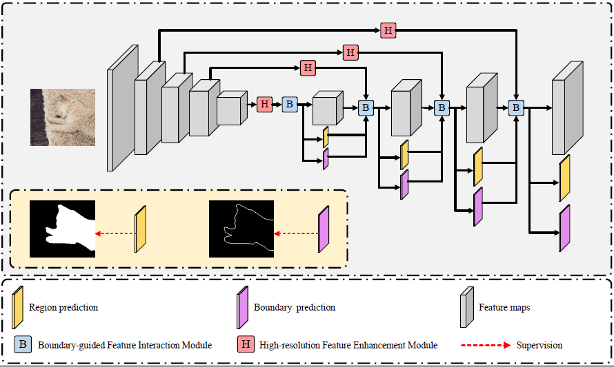
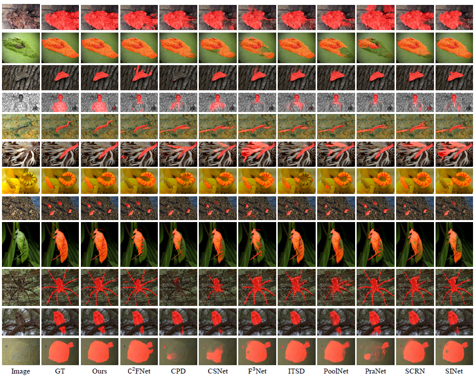
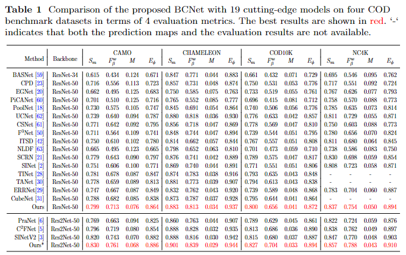

# BCNet
This repo. is an official implementation of the *BCNet* , which has been submitted to the journal *Neural computing and applications, 2022*. 

The main pipeline is shown as the following, 

And some results are presented

## Datasets
Training and testing datasets are available at 
Baidu: ([Datasets](https://pan.baidu.com/s/1QF7WhYc-7DG5152g52G-aQ)) [code:uf1q]
Google: https://drive.google.com/file/d/1VS8qVUjC__4BZhB-13S3wHDWAs_-YFDI/view?usp=sharing

## Results

The prediction maps are also available
([Res2Net](https://pan.baidu.com/s/1SWkpcIgJcwqv-O8CDP0eMw)) [code:ed7u]
([ResNet](https://pan.baidu.com/s/1pREE4szqBXtLFN2IBk0Wrw)) [code:h3yr]
